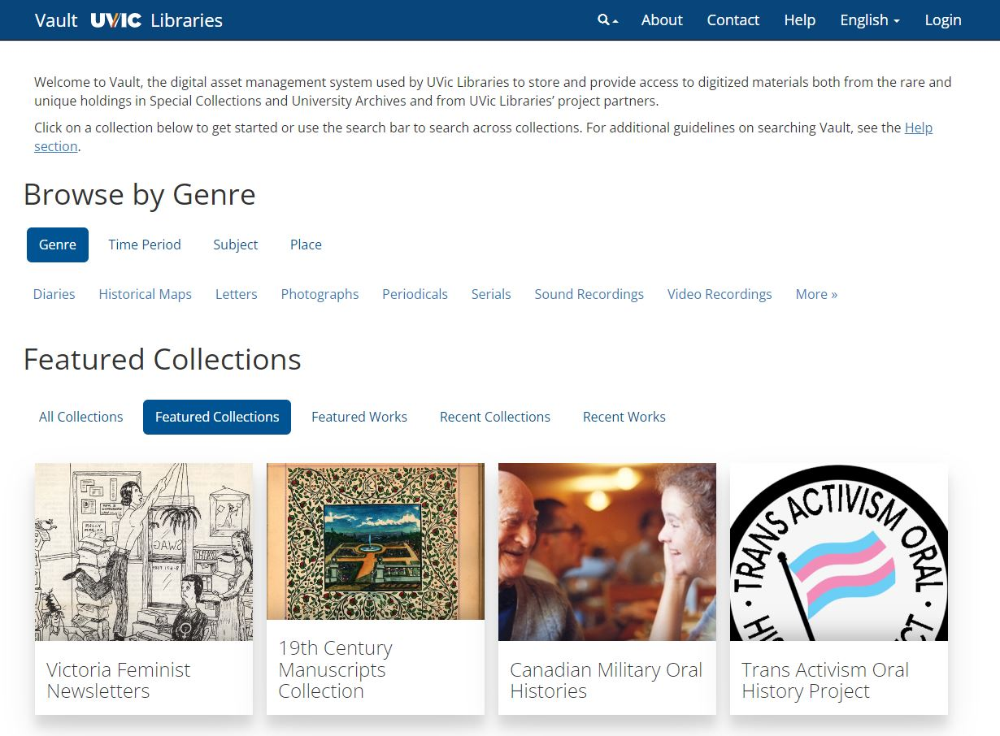

# Vault, the University of Victoria Libraries' Digital Repository Application

This repository contains code for [Vault](https://vault.library.uvic.ca/), a [Hyku-based](https://github.com/samvera/hyku)
application at the University of Victoria (UVic) Libraries.  Vault is a digital asset management system for digitized 
and born-digital materials in UVic Special Collections, Archives, or other UVic or community-based collections. Examples 
of objects we store within Vault include high-resolution scans of historical maps, oral histories and interviews of 
trans activists, war diaries, and medieval manuscripts.

The main branch of this code repository contains in-production code, while the docker branch is what we use and recommend
for local development (see the [Developing with Docker](./Developing_with_Docker.md) page). Vault is based on an 
open-source application called [Hyku](https://github.com/samvera/hyku), which is developed and maintained by the 
Samvera community and uses the [Hyrax](https://github.com/samvera/hyrax) engine.

If you're completely new to Samvera, we recommend reading the [Hyku documentation](https://samvera.atlassian.net/wiki/spaces/hyku/overview?homepageId=715789904) 
first, or this [description of the technology stack](https://samvera.github.io/our_technology_stack.html) if you're more 
technically-minded. Then read this introductory page on [Collections, Works, and File Sets](./documentation/Collections_Works_File_Sets.md) and explore 
using the Vault interface. 

In terms of Vault-specific features, see [the wiki](https://github.com/UVicLibrary/Vault/wiki) for documentation on using the interface or the 
[documentation folder](./documentation) of this repo for code documentation. A list of topics (with links) for the latter is below:

## Gem Versions (Dependencies)
See the Gemfile for a full listing. Major highlights:
* **Hyku** - somewhere between versions 2 and 3 (we've mixed and matched features from both)
* **Hyrax 3.0.2**
* **Active Fedora 13.1**
* **Sidekiq 5.x**