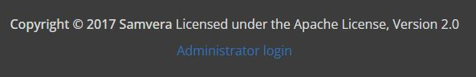

# Multitenancy: Creating Your First Tenant

### Table of Contents
* [Start up Docker and the Rails Server](#start-up-docker-and-the-rails-server)
* [Create a User Account](#create-a-user-account)
* [Create a New Tenant](#create-a-new-tenant)
* [Troubleshooting Solr and Fedora Connections](#troubleshooting-solr-and-fedora-connections)
  * [Double-check your .env and docker-compose.yml files](#double-check-your-env-and-docker-composeyml-files)
  * [Verify if the Solr collection was created](#verify-if-the-solr-collection-was-created)
  * [Verify if the Fedora container was created](#verify-if-the-fedora-container-was-created)
* [Set Up Testing (RSpec)](#set-up-testing-rspec)
  * [Set up the test database](#set-up-the-test-database)
  * [Create the Solr test collection](#create-the-solr-test-collection)
  * [Create the Fedora test container](#create-the-fedora-test-container)

### Start up Docker and the Rails Server
1. Inside the Vault folder that you've downloaded/cloned from GitHub, run `docker-compose up -d web`
2. Run `docker exec -it vault_web_1 bash` to start bash inside the web container.
3. Run `rails s -b 0.0.0.0` to start the web server.

### Create a User Account
1. In your browser of choice, visit `localhost:3000`. You should see the Hyku welcome page (image below). Note that this page may load very slowly the first time.

2. In the bottom right corner, there should be an Administrator Login link (image below). Log in with the credentials you made in [Step 4 of the Docker instructions](./Developing_with_Docker.md#step-4-first-time-setup-and-startingrunning-the-application).


 If you haven't created a superadmin account already, you can create a new user now by clicking "Sign up." If you do this, you will have to open a separate bash window, run `rake hyku:superadmin:grant["email_address"]`, replacing `email_address` with the email address associated with your new account. For example, if your email address is "example@email.com", the command would be `rake hyku:superadmin:grant["example@email.com"]`.
  
### Create a New Tenant
1. Once logged in, you should be able to create a new tenant (called an "Account" in the interface). You may be redirected automatically if there are no tenants, or you can visit `localhost:3000/proprietor/accounts/new` in your browser.
2. When prompted for the short name, type in `vault` and click Save. (Many aspects of Vault's display, such as the homepage and navigation bar, are keyed to the short name.)
3. If everything went smoothly, you should also be prompted to "invite" a user to create an admin account for the Vault tenant specifically (this won't actually send an email). Type in your email address (it can be the same as your superadmin account). After clicking the invite button, go to your terminal window that is running the rails server. Scroll up until you find the text of the invite email like the picture below:


Copy paste the link that starts with `vault.localhost/users/invitation/accept...` and paste it into your browser. Then edit the URL by adding `:3000` to the end of localhost (`vault.localhost:3000/users/invitation...`). Hit Enter and you should be prompted to create a password for your new admin account.

If you prefer to create a new admin account via the rails console, here is the command to do so (replace email and password with your own):
```ruby
user = User.find_or_create_by(email: email) do |f|
    created = true
    f.password = password
end
user.roles << "admin"
user.save
```

4. Visit `vault.localhost:3000` and login to see your new tenant in action!

### Creating Default Collection and Work Types (Recommended)

5. In `home/webapp/app`, stop the server if you're running it. Then run the command `rails hyrax:default_collection_types:create` to create the "User Collection" collection type.


6. Start the server again (`rails s -b 0.0.0.0`) and navigate to Dashboard > Settings > Available Work Types. Check the box next to GenericWork. Click "Save Changes".

### Troubleshooting Solr and Fedora Connections
If you get an error message, the application may not be connecting to Solr or Fedora properly, or it may not have created the necessary Solr collection or Fedora container. Here are some things to try if you're seeing errors:

#### Double-check your .env and docker-compose.yml files
First, it's worth double-checking that your environment is set up the way you intended. Both the Fedora and Solr URLs are set in the `.env` file.

| Service | Variable Name | Location | Accessible in the Browser At... |
|---|---|---|---|
| Solr | SOLR_URL | .env (if SOLR_URL is not defined, the app will look in `config/blacklight.yml` or `config/settings.yml` )| localhost:8983 |
| Fedora | FEDORA_URL | .env | localhost:8080 |

You can use the account admin interface and the rails console to check if the Solr and Fedora URLs are what you expect (i.e. the same as those defined in your files).

After opening bash in the web container, run `rails c` to open the console.

```ruby
# In multitenant mode:
    account = Account.find_by(cname: "vault.localhost")
    
    # The following command should return something like 
    # http://solr:8983/solr/xxxxxxxx where xxxxxxx is the same as account.tenant
    account.solr_endpoint.url
    
    # The result of the following 2 commands should be the same as above.
    # If it's not, you may have overridden the Solr URL somewhere
    AccountElevator.switch! "vault.localhost"
    Blackight.connection_config['url']
    
    # The following should be the same as account.tenant (with a / in front)
    account.fcrepo_endpoint.base_path

# In single-tenant mode
    # This command should return the SOLR_URL in .env
    Blacklight.connection_config['url']

    # This should return the FEDORA_URL in .env
    ActiveFedora.fedora.base_uri
```

#### Verify if the Solr collection was created
Go to `locahost:8983` to open the Solr Dashboard. In the left sidebar, click on the "Collection Selection" dropdown to expand it. You should see the tenant UUID, which you can find with the `account.tennant` command above or by going to [http://localhost:3000/proprietor/accounts](http://localhost:3000/proprietor/accounts).


If the Solr collection wasn't created, you can quickly create one using the [instructions](#create-the-solr-test-collection) below, although it's better to track down the source of the error.

#### Verify if the Fedora container was created
Open the Fedora web interface in the browser (see the table above) and click the "Fedora REST API endpoint" button. This should take you to your Fedora repo page.

Under "Children", you should see your tenant UUID, which you can find with the `account.tennant` command above or by going to [http://localhost:3000/proprietor/accounts](http://localhost:3000/proprietor/accounts).

If the Fedora container wasn't created, you can quickly create one using the [instructions](#create-the-fedora-test-container) below, although it's better to track down the source of the error.

### Set Up Testing (RSpec)
When running automated tests with RSpec, it's important to keep our test and development environments separate. This is because we often delete test data after it's created to reset for the next test while saving storage space. We don't want to delete our development data by accident or clog up our dev environment by repeatedly running tests!

#### Set up the test database
Open a bash console in the web container and run the commands
```
rails db:setup RAILS_ENV=test
# If you get errors, you may have to add bundle exec:
bundle exec rails db:setup
```

#### Error message: FATAL database "hyku_test" does not exist

This error is strange since we know the database does not exist because we're trying to create it with `rails db:setup`. Nevertheless, trying to run `rails db:create RAILS_ENV=test` or `bundle exec rails db:create RAILS_ENV=test` can still fail.

In this case, we can still create the database in the `db` container directly. In Terminal/Powershell, type the following commands:
```
# This opens the command line in the (postgres) database container
docker exec -it vault_db_1 sh
# This creates a database with the name set in your .env file
createdb $DATABASE_TEST_NAME -U $POSTGRES_USER
# Go back to Terminal/Powershell
exit
```
Then open bash in the web container (`docker exec -it vault_web_1 bash`) and run `rails db:setup` again.

#### Create the Solr test collection
1. Go to the Solr Dashboard at [localhost:8983](http://localhost:8983).
2. In the left sidebar, click **Collections > Add Collection**.
3. Name the new collection **test** and select the hyku config set. Then click **Add Collection**. You can change the name if you wish, but it must match `config/blacklight.yml` and `config/solr.yml`.

#### Create the Fedora test container
1. Open the Fedora interface as described above (under Verify the Fedora container). After entering the tenant container, the test container may already have been created.
2. If not, in the right sidebar, under **Create New Child Resource**, type **test** in the **Identifier** box.
3. **Click Add**.