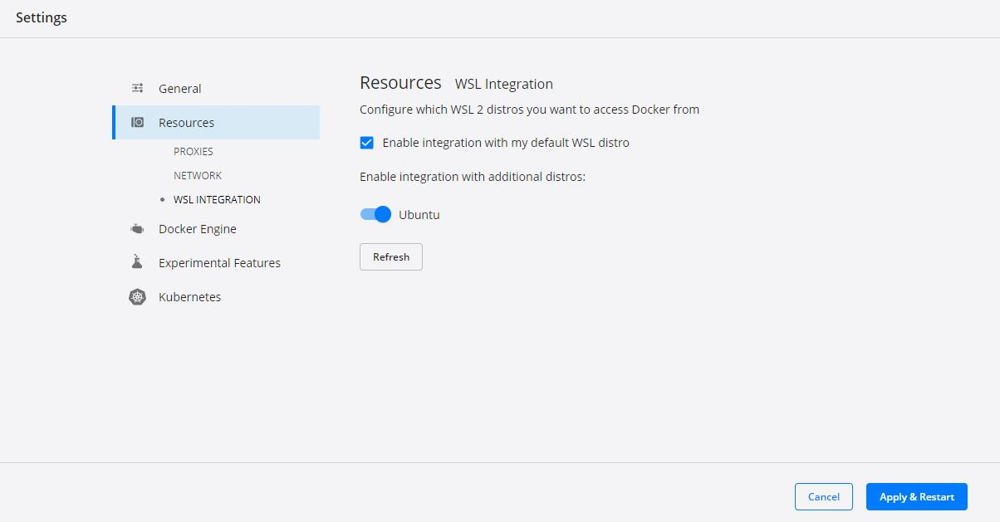

# Speeding up Docker on Windows

Running Docker Desktop on Windows can be very slow depending on your computer's RAM and whether you're using WSL (Windows Subsystem for Linux) 2 and Ubuntu (instead of Powershell). In fact, the latter is the most likely culprit. This page covers how to fix it below, as well as other techniques for speeding up Docker.

### Table of Contents
* [Speeding up with WSL 2 / Ubuntu Integration](#speeding-up-with-wsl-2--ubuntu-integration)
  * [Using WSL 2 as the Docker Backend](#using-wsl-2-as-the-docker-backend)
  * [Starting Docker from Ubuntu](#starting-docker-from-ubuntu)
  * [Optional: Integration with Github Desktop](#optional-integration-with-github-desktop)
    * [A. Run Github Desktop as Adminstrator](#a-run-github-desktop-as-administrator)
    * [B. Create a Symlink](#b-create-a-symlink)
* [Running Docker Simultaneously with Other Programs](#running-docker-simultaneously-with-other-programs)
  * [Reduce Other Applications' Memory Usage](#reduce-other-applications-memory-usage)
  * [Increase the Amount of RAM Docker has Access to](#increase-the-amount-of-ram-docker-has-access-to)

## Speeding up with WSL 2 / Ubuntu Integration

### Using WSL 2 as the Docker Backend
1. Firstly, we can double-check whether we're using WSL 2 by checking our Docker settings. In Docker Desktop, click the gear icon to open Settings > General > ensure that "Use the WSL 2 based engine" is checked. If it's not, follow these [steps to enable WSL 2](https://docs.docker.com/desktop/wsl/).

2. Next, we need to confirm whether Ubuntu is using WSL 2 or WSL 1. Open Windows Terminal and a new Powershell tab. In Powershell, use the command `wsl.exe -l -v` to print a list of your ["Linux distros"](https://docs.docker.com/desktop/wsl/#enabling-docker-support-in-wsl-2-distros). You should see something like the following:
    ```
    NAME                  STATE     VERSION
    Ubuntu                ...        2
    docker-desktop-data   ...        2
    docker-desktop        ...        2
    ```
    1. If the Ubuntu version is 1 instead of 2, then it needs to be changed to 2. Luckily, this should be as simple as running `wsl.exe --set-version Ubuntu 2`. Anecdotally, this can take anywhere from a few minutes to [a few hours](https://github.com/microsoft/WSL/issues/5344). If it's taking a long time, you can try pressing `Cntrl + c` to stop the process and then rerun `wsl.exe --set-version Ubuntu 2`.

3. Finally, we need to integrate Docker with Ubuntu. In Docker Desktop, go to Settings > Resources > WSL Integration. (We may need to restart Docker Desktop if we changed the version as above.) Under "Enable integration with additional distros," you should now see an option to integrate with Ubuntu. Toggle the option on, then click Apply and Restart.



### Starting Docker from Ubuntu

According to Docker's [page on best practices](https://docs.docker.com/desktop/wsl/best-practices/), Docker performs much better when it is running in the Linux file system rather than Windows (Microsoft claims that it can be [up to 20x faster](https://learn.microsoft.com/en-us/windows/wsl/compare-versions#increased-file-io-performance)). This means that **we want to start all our docker containers in Ubuntu rather than Powershell whenever possible**.

To start, open a new tab in Ubuntu (in Windows Terminal), then run `cd ~` and `ls`. If there's no Vault directory in there yet, you can move or copy it from `/mnt/c/<user name>/...`, replacing `...` with the file path to your cloned Vault dir in Windows. 

Note: you can technically start up docker from `/mnt/c/<user name>/...`, but this will not result in Docker running faster because it's still technically using the Windows file system.

Now you can cd into Vault and run `docker-compose up -d`. (You can also see/edit these files in Windows Explorer by typing the path in as `\\wsl$\Ubuntu\<dir name>`.) If you get an error message like "no command called docker-compose", that means that Docker isn't actually sharing the file system with Ubuntu and you should review the steps above.

### Optional: Integration with Github Desktop

#### Cloning Vault Repo Directly to Linux Filesystem

After integrating Ubuntu with WSL 2, you should be able to clone the directory into `\\wsl$\Ubuntu\Vault` (or another directory in `\\wsl$\Ubuntu` as desired).

#### Moving an Existing Github Repo to Linux Filesystem

Note that you will need administrator permissions on your computer for both options below (select one or the other). The difference is that with option A, you'll have to remember to run Github Desktop as an administrator every time. For this reason, I personally prefer option B.

##### A. Run Github Desktop as Administrator

If you open Github Desktop, it will then automatically prompt you select a new location, at which point you select the new wsl path.

Selecting the wsl path may bring up a permissions error. In this case, you can run Github Desktop as an administrator forever-more (right-click on the program > Run as Adminstrator), or you can [create a symlink](https://woshub.com/create-symlink-windows/) from where the Vault directory used to be to where it is now.

##### B. Create a Symlink

To work around the permissions issue, we can link the Vault directory in the Linux filesystem to a new "directory" tracked by Git. This way, we can make changes to our code by editing files in either place and they will show up in Github Desktop.

The easiest way to create a link is to use open the Windows command prompt (Start > type `cmd` and hit Enter), although you can accomplish the same thing in Powershell with a different syntax. With command prompt open, use the `mklink` command with the syntax `mlink /D <path to linked folder (you want to create)> <path to wsl folder>`. For example, if your Vault repo used to be at `C:\\Users\Tenzing\Documents\Github\Vault`, and now it's at `\\wsl$\Ubuntu\home\tenzing\Vault`, then the full command would be

```
mklink /D C:\Users\Tenzing\Documents\GitHub\Vault \\wsl$\Ubuntu\home\tenzing\Vault
```

You should receive a confirmation message like `symbolic link created for ...`.

## Running Docker Simultaneously with Other Programs
When coding, developers often need to have multiple programs open at the same time. For example, in addition to Docker, you might be running a code editor such as VS Code, a web browser, Github Desktop, and Windows Terminal all at the same time. This can strain your computer's resources (i.e. use up all its RAM) and cause slowdowns.

Although WSL 2 integration will speed up Docker a lot and likely enough, you can try some of the techniques below if you're still noticing slowness and increasing RAM is not an option.

### Reduce Other Applications' Memory Usage
Some applications, such as [RubyMine](https://www.jetbrains.com/ruby/) or Google Chrome, can be quite RAM-hungry. To minimize memory usage, you can try finding alternatives with a smaller footprint (e.g. Firefox browser) or search for other ways specific to the program.

For example, with RubyMine, you can look for unused packages than can be removed. Or you can use Firefox instead of Chrome. Another idea is to open applications only when you need them and exit them when you're not actively using them. You can also use Windows Task Manager to get a better idea of RAM usage and where you might be able to make improvements.

You can also consider closing applications you aren't actively using or only open them when absolutely necessary (e.g. only open Github Desktop when you're ready to commit changes).

### Increase the Amount of RAM Docker has Access to

When using Docker with WSL 2, memory allocation is configured via a `.wslconfig` file in your `%UserProfile%` directory (see this [Microsoft webpage on Advanced settings configuration](https://learn.microsoft.com/en-us/windows/wsl/wsl-config#wslconfig)). You can follow M. Rake Linggar A.'s step-by-step [instructions for creating a.wslconfig file](https://mrakelinggar.medium.com/set-up-configs-like-memory-limits-in-docker-for-windows-and-wsl2-80689997309c). Here is an example `.wslconfig` file from his article below:

```
# Settings apply across all Linux distros running on WSL 2
[wsl2]
# Limits VM memory to use no more than 4 GB, this can be set as whole numbers using GB or MB
memory=4GB
# Sets the VM to use two virtual processors
processors=2
# Specify a custom Linux kernel to use with your installed distros. The default kernel used can be found at https://github.com/microsoft/WSL2-Linux-Kernel
kernel=C:\\temp\\myCustomKernel
# Sets additional kernel parameters, in this case enabling older Linux base images such as Centos 6
kernelCommandLine = vsyscall=emulate
# Sets amount of swap storage space to 8GB, default is 25% of available RAM
swap=8GB
# Sets swapfile path location, default is %USERPROFILE%\AppData\Local\Temp\swap.vhdx
swapfile=C:\\temp\\wsl-swap.vhdx
# Disable page reporting so WSL retains all allocated memory claimed from Windows and releases none back when free
pageReporting=false
# Turn off default connection to bind WSL 2 localhost to Windows localhost
localhostforwarding=true
# Disables nested virtualization
nestedVirtualization=false
# Turns on output console showing contents of dmesg when opening a WSL 2 distro for debugging
debugConsole=true
``` 

Next Page: [Multitenancy: Creating Your First Tenant >>](./Multitenancy.md)