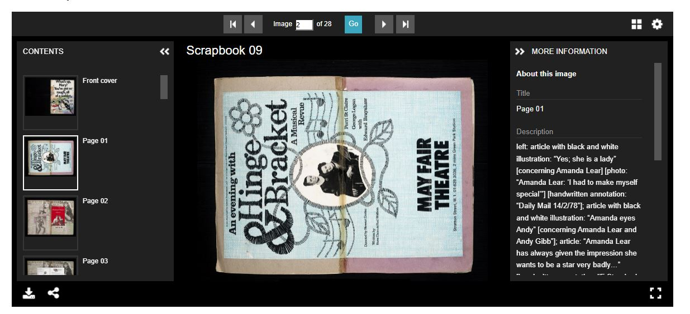
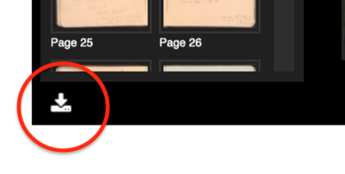

# Universal Viewer and IIIF

### Introduction

Like Samvera/Hyrax, we (University of Victoria Libraries) use Universal Viewer (UV)
as our [IIIF](https://iiif.io/) viewer for images. To see it in action, 
you can run [a search for "Still Image"](https://vault.library.uvic.ca/catalog?f%5Bresource_type_sim%5D%5B%5D=http%3A%2F%2Fpurl.org%2Fdc%2Fdcmitype%2FStillImage&locale=en&q=&search_field=all_fields) 
resource types in Vault and select an item from the results. To view the 
IIIF manifest for any work, go to the page for a work, add "/manifest.json" 
to the end of the URL, and hit Enter. For example, for [this work](https://vault.library.uvic.ca/concern/generic_works/2cca99e7-656c-40ca-baab-8696aedadeb7),
the manifest URL would be `https://vault.library.uvic.ca/concern/generic_works/2cca99e7-656c-40ca-baab-8696aedadeb7/manifest.json`.

### Viewer Installation

If you are using our Docker image, UV should work "out of the box" after 
building the container running the server for the first time.

Note that our approach to installing the viewer differs from Hyrax/Hyku in key ways 
(see [this commit](https://github.com/UVicLibrary/Vault/commit/b2fdc7cda6e0b12b37c2bfbff8e12a572184adc6)). 
We use npm instead of yarn to install our viewer and we track all files in `public/uv` since 
we've customized them.

The key lines in our Dockerfile are:
```dockerfile
RUN apt-get update -qq && \
# ...
# Install npm
    apt-get install -y build-essential libpq-dev nodejs npm libreoffice imagemagick unzip ghostscript && \
#...
# Install universalviewer into node/node_modules
RUN mkdir /node
RUN  npm install universalviewer@3.0.36 --prefix /node
```

Note that any changes to `node_modules` will not persist if you stop and restart the container. 
If you want to make your own customizations, we recommend doing that in `public/uv`, or uninstalling/reinstalling 
UV with yarn and editing `node_modules` once they are reinstalled in `/data`.

We have provided a `package.json` in the root app folder as well, which can be run with `yarn install`. 
If you install a different version of UV with yarn, you'll need to copy the files from `/data/node_modules/dist` 
into `/data/public/uv`, overwriting any customizations that were previously there.

### Vault Customizations

#### Displaying File Set Metadata



In order to detect which file set is currently being viewed, we insert a custom event into `/public/uv/lib/GalleryComponent.js`. 

```javascript
console.log("Thumbs loaded");
var event = new Event('thumbsLoaded');
document.dispatchEvent(event);
```

Then we add an event listener in a `<script>` in `/public/uv.html` (this is so the script only runs once on a page
with the viewer to avoid throwing errors). When the thumbnails are loaded, we send an [AJAX request](https://developer.mozilla.org/en-US/docs/Web/Guide/AJAX/Getting_Started) 
to the `manifest.json` and parse it to find the file set metadata (canvas-level metadata when talking in IIIF terms) that corresponds to the 
currently selected image in the viewer. This is done by looking for the matching canvas/file set ID.

See [the full code](https://github.com/UVicLibrary/Vault/blob/main/public/uv/uv.html) for more code details.

```javascript
document.addEventListener('thumbsLoaded', function (e) {
    var manifestUrl = window.location.hash.split('&')[0].replace('#?manifest=', '') + '.json';
    // When the AJAX request has finished
    $.get(manifestUrl).done(function(data) {
       // Do the thing
       // ...
    });
});
```

Note that Hyrax and the [IIIFManifest](https://github.com/samvera/iiif_manifest) gem does not support canvas-level 
metadata by default. That is another Vault customization: you can see the code for this in [CustomManifestBuilderService](https://github.com/UVicLibrary/Vault/blob/main/app/services/hyrax/custom_manifest_builder_service.rb).   

#### Removing the Download Button for Some Works



To do this, we first create a no-download config file in `public/uv` called `uv-config-no-download.json`:

```json
{
  "options": {

  },
  "modules": {
    "footerPanel": {
      "options": {
        "downloadEnabled": false
      }
    }
  }
}
```

Then we can add some sort of helper method in a file such as `app/helpers/hyrax/iiif_helper.rb` that we can call 
from the `<iframe>` in the Hyrax view.

```erbruby
# Helper method
def universal_viewer_config_url(work_presenter)
  if request.base_url.include? "vault"
    if GenericWork.find(work_presenter.id).downloadable? or can?(:edit, work_presenter.id)
      "#{request&.base_url}/uv/uv-config.json"
    else
      "#{request&.base_url}/uv/uv-config-no-download.json"
    end
  else
    "#{request&.base_url}/uv/uv-config.json"
  end
end

# app/views/hyrax/base/iiif_viewers/_universal_viewer.html.erb
  <iframe
    src="<%= universal_viewer_base_url(presenter) %>#?manifest=<%= main_app.polymorphic_url [main_app, :manifest, presenter], { locale: nil } %>&config=<%= universal_viewer_config_url(presenter) %>"
    allowfullscreen="true"
    frameborder="0"
    id="universal-viewer"
    style="width:100%; height:480px;"
  ></iframe>
```